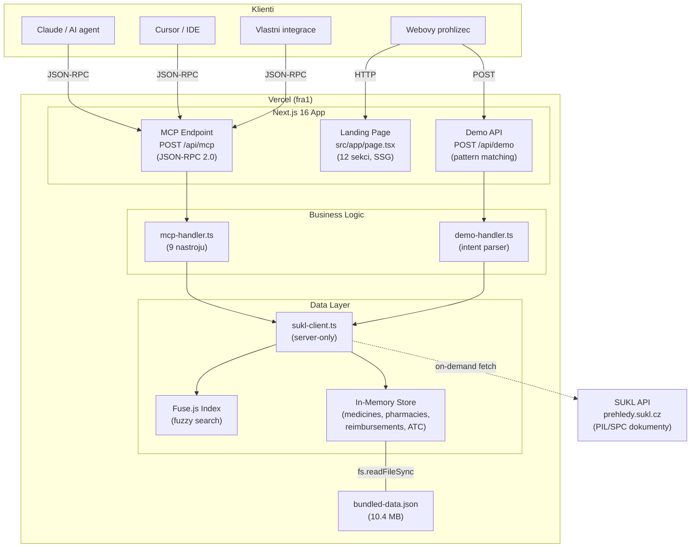
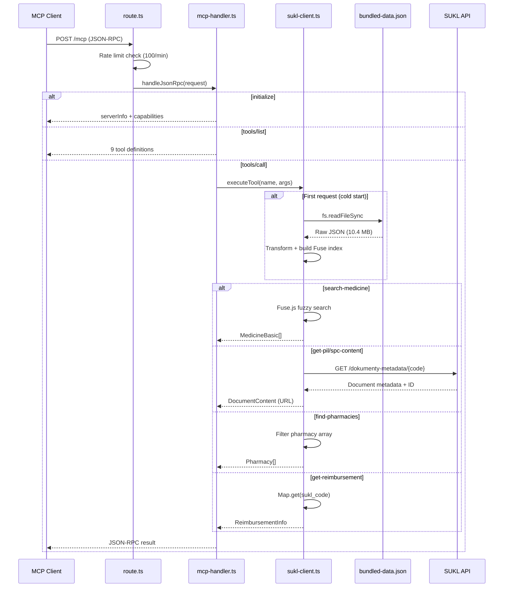
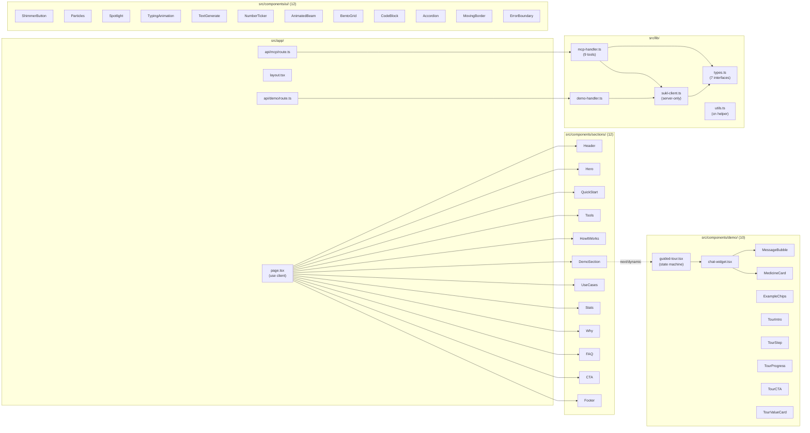
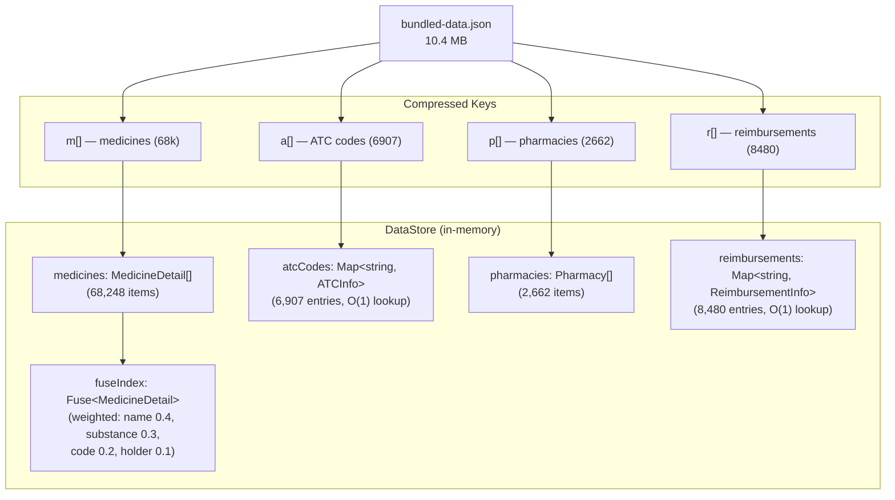
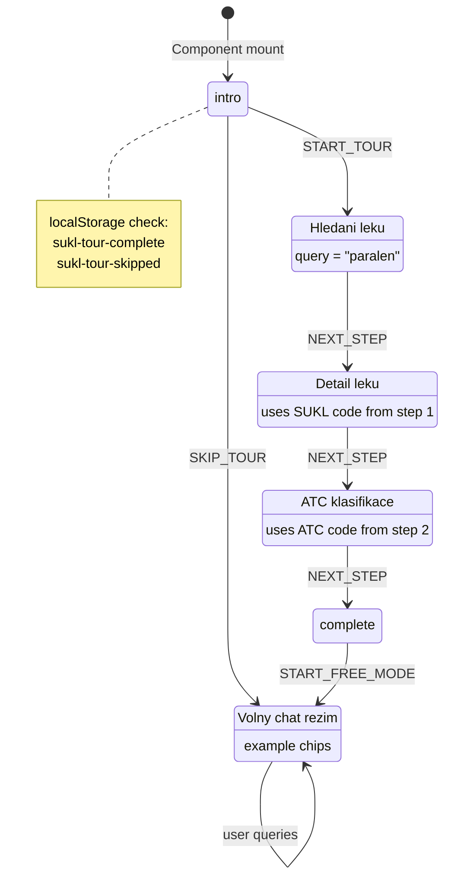
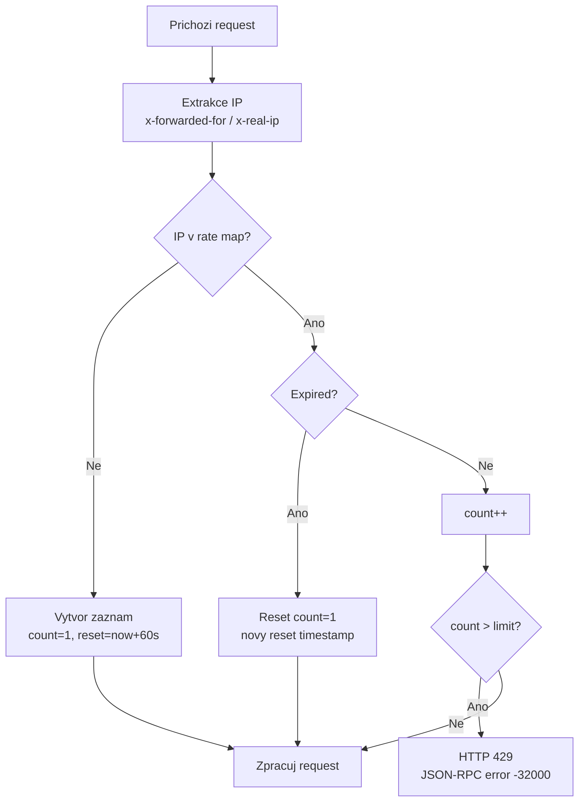
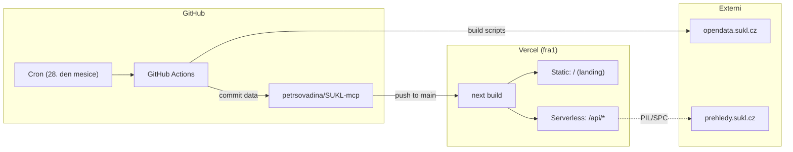

# SUKL MCP Server — Architektura

## Prehled systemu

---

## Datovy tok

---

## Komponentova architektura

---

## In-Memory Data Store

**Cache politika:** Data se nacitaji pri prvnim pozadavku a cachuji 1 hodinu. Na serverless (Vercel) cache zije po dobu zivotnosti instance.

---

## Demo Guided Tour — stavovy automat

---

## Rate Limiting

| Endpoint | Limit | Okno |
|----------|-------|------|
| `/api/mcp` | 100 req | 1 min |
| `/api/demo` | 10 req | 1 min |

> In-memory Map se resetuje pri cold startu serverless instance.

---

## Deployment

---

## Bezpecnost

- **CSP header:** `default-src 'self'; script-src 'self' 'unsafe-inline' 'unsafe-eval'; frame-ancestors 'none'`
- **X-Frame-Options:** DENY
- **X-Content-Type-Options:** nosniff
- **Referrer-Policy:** strict-origin-when-cross-origin
- **CORS:** Wildcard (`*`) pouze na `/api/mcp` — nezbytne pro MCP klienty
- **Rate limiting:** In-memory per IP
- **Validace vstupu:** Vse validovano pred zpracovanim (delka, typ, rozsah)
- **Error masking:** Runtime chyby vraceny jako genericka zprava, detaily pouze v logu
