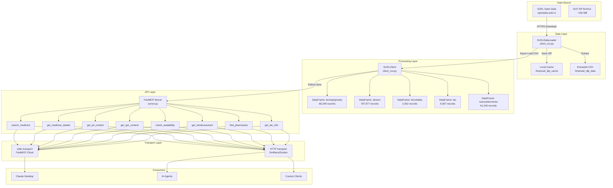
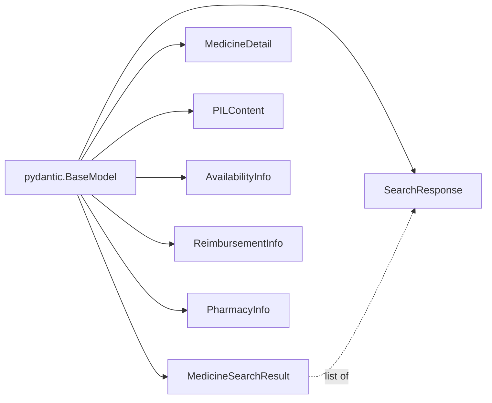
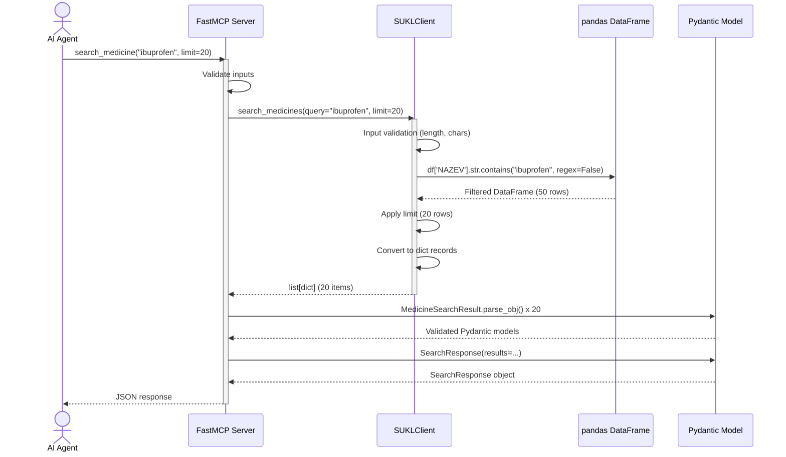
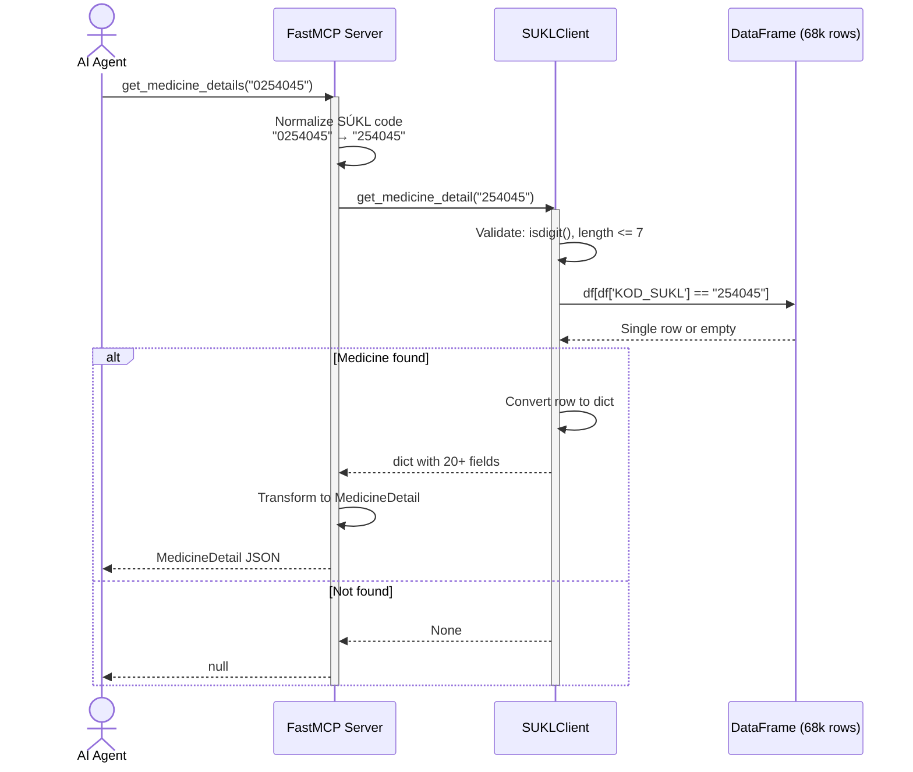
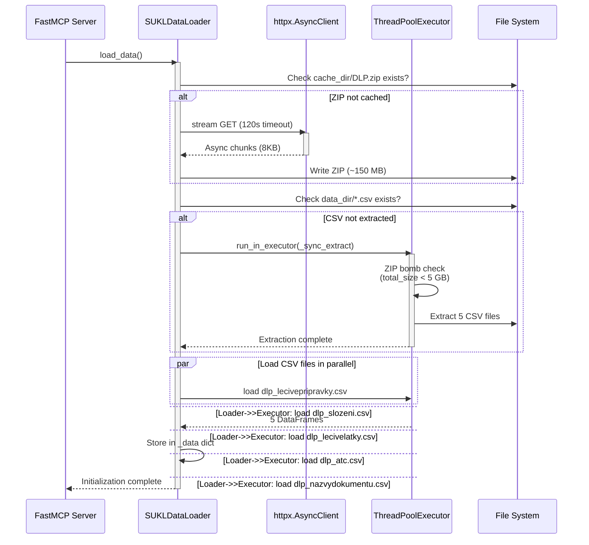
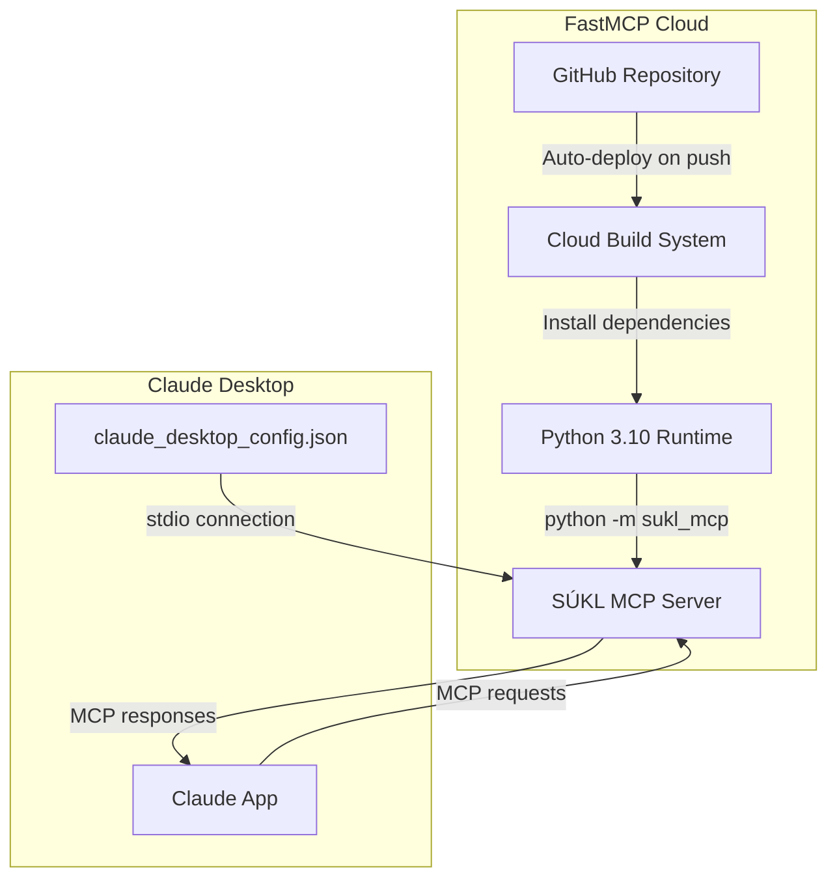
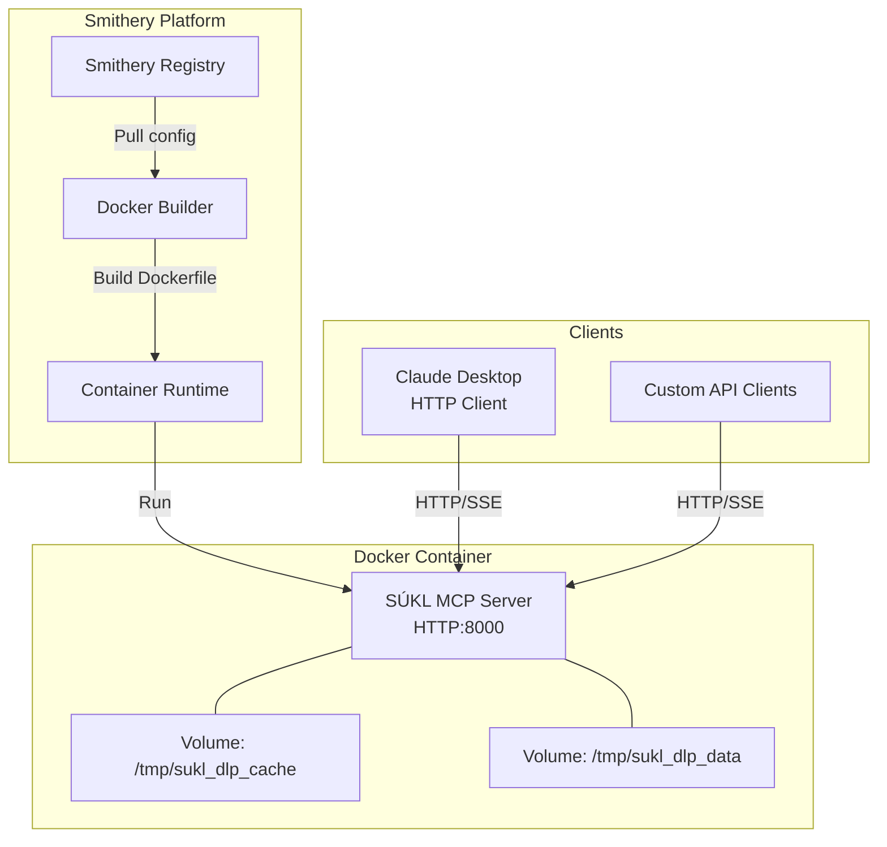
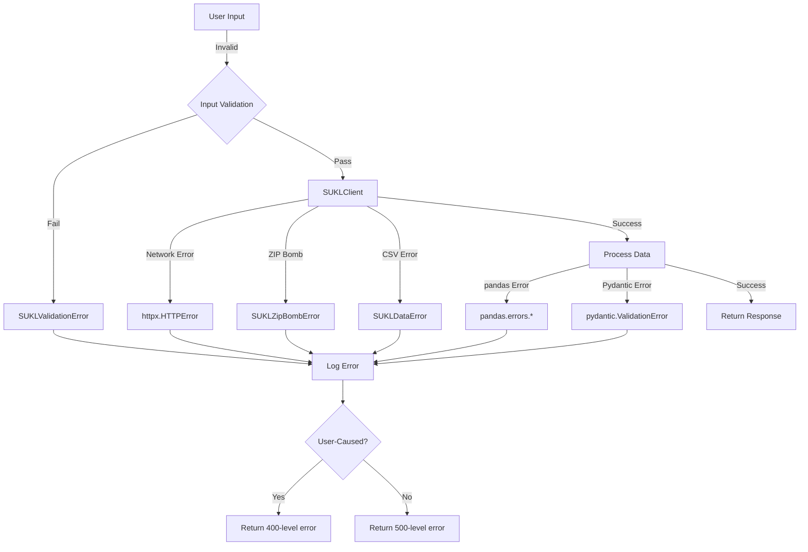

# System Architecture

## Executive Summary

The SÚKL MCP Server is a multi-layer Python application that transforms Czech pharmaceutical open data into an AI-accessible interface using the Model Context Protocol (MCP). The architecture prioritizes data integrity, performance, and security while maintaining simplicity for deployment across multiple platforms.

## System Architecture Diagram



## Component Architecture

### 1. Data Acquisition Layer (SUKLDataLoader)

**Location**: `/src/sukl_mcp/client_csv.py` (lines 62-179)

**Responsibilities**:
- Download ZIP archive from SÚKL Open Data
- ZIP bomb protection (max 5 GB)
- Async extraction using executor
- Parallel CSV loading (5 files simultaneously)

**Key Design Decisions**:

1. **Async I/O Pattern**
   - Uses `httpx.AsyncClient` for non-blocking downloads
   - `loop.run_in_executor()` for CPU-intensive ZIP extraction
   - `asyncio.gather()` for parallel CSV loading
   - Result: 3-5x faster initialization vs sequential loading

2. **Security Features**
   ```python
   # ZIP bomb protection (lines 118-125)
   total_size = sum(info.file_size for info in zip_ref.infolist())
   max_size = 5 * 1024 * 1024 * 1024  # 5 GB
   if total_size > max_size:
       raise SUKLZipBombError(...)
   ```

3. **Cache Strategy**
   - ZIP cached at `SUKL_CACHE_DIR` (default: `/tmp/sukl_dlp_cache`)
   - Extracted CSV at `SUKL_DATA_DIR` (default: `/tmp/sukl_dlp_data`)
   - No automatic refresh - manual update required

**Configuration**:
```python
class SUKLConfig(BaseModel):
    opendata_dlp_url: str  # Data source URL
    cache_dir: Path        # ZIP storage
    data_dir: Path         # CSV extraction
    download_timeout: float # HTTP timeout (default: 120s)
```

### 2. Data Access Layer (SUKLClient)

**Location**: `/src/sukl_mcp/client_csv.py` (lines 181-367)

**Responsibilities**:
- Initialize data loader
- Provide search and filter operations
- Input validation and sanitization
- Thread-safe singleton pattern

**Key Methods**:

| Method | Purpose | Complexity |
|--------|---------|-----------|
| `search_medicines()` | Full-text search in medicine names | O(n) - DataFrame scan |
| `get_medicine_detail()` | Fetch single medicine by SÚKL code | O(n) - DataFrame filter |
| `get_composition()` | Get medicine composition | O(n) - DataFrame filter |
| `get_atc_groups()` | ATC classification lookup | O(n) - DataFrame filter |
| `search_pharmacies()` | Find pharmacies (NOT IMPLEMENTED) | N/A |

**Thread-Safe Singleton** (lines 338-367):
```python
_client: Optional[SUKLClient] = None
_client_lock: asyncio.Lock = asyncio.Lock()

async def get_sukl_client() -> SUKLClient:
    """Double-checked locking pattern"""
    if _client is not None:
        return _client

    async with _client_lock:
        if _client is None:
            _client = SUKLClient()
            await _client.initialize()

    return _client
```

**Rationale**: Prevents race conditions during concurrent initialization while avoiding lock overhead for repeated access.

### 3. Data Models Layer (Pydantic)

**Location**: `/src/sukl_mcp/models.py`

**Purpose**: Type-safe data structures with runtime validation

**Model Hierarchy**:



**Key Models**:

1. **MedicineSearchResult** (lines 37-51)
   - Lightweight search result
   - 11 fields including availability and reimbursement flags
   - Used in `search_medicine` tool responses

2. **MedicineDetail** (lines 53-98)
   - Comprehensive medicine information
   - 27 fields including registration, pricing, documents
   - Used in `get_medicine_details` tool responses

3. **SearchResponse** (lines 178-185)
   - Wrapper for search results
   - Includes query, count, results, and timing

**Enums**:
- `RegistrationStatus` (lines 14-21): R, B, C, P, D
- `DispensationMode` (lines 24-32): Rp, Rp/o, F, Lp, V

### 4. FastMCP Server Layer

**Location**: `/src/sukl_mcp/server.py`

**Lifecycle Management** (lines 30-45):
```python
@asynccontextmanager
async def server_lifespan(server):
    """Initialize client on startup, cleanup on shutdown"""
    logger.info("Starting SÚKL MCP Server...")
    client = await get_sukl_client()
    health = await client.health_check()
    logger.info(f"Health check: {health}")

    yield

    logger.info("Shutting down SÚKL MCP Server...")
    await close_sukl_client()
```

**FastMCP Instance** (lines 49-66):
```python
mcp = FastMCP(
    name="SÚKL MCP Server",
    version="2.1.0",
    lifespan=server_lifespan,
    instructions="""..."""
)
```

**Tool Registration Pattern**:
```python
@mcp.tool
async def search_medicine(
    query: str,
    only_available: bool = False,
    only_reimbursed: bool = False,
    limit: int = 20,
) -> SearchResponse:
    """Docstring becomes tool description"""
    client = await get_sukl_client()
    # ... implementation
    return SearchResponse(...)
```

### 5. Transport Layer

**Automatic Transport Detection** (lines 417-435):
```python
def main():
    transport = os.getenv("MCP_TRANSPORT", "stdio").lower()

    if transport in {"http", "sse", "streamable-http"}:
        # HTTP for Smithery/Docker
        host = os.getenv("MCP_HOST", "0.0.0.0")
        port = int(os.getenv("MCP_PORT", "8000"))
        mcp.run(transport=transport, host=host, port=port)
    else:
        # stdio for FastMCP Cloud and Claude Desktop
        mcp.run()
```

## Data Flow Diagrams

### Search Medicine Flow



### Medicine Detail Flow



### Data Loading Flow (Startup)



## Security Architecture

### 1. ZIP Bomb Protection

**Threat**: Malicious ZIP archive that expands to exhaust disk space

**Mitigation** (`client_csv.py`, lines 118-125):
```python
total_size = sum(info.file_size for info in zip_ref.infolist())
max_size = 5 * 1024 * 1024 * 1024  # 5 GB limit

if total_size > max_size:
    raise SUKLZipBombError(
        f"ZIP příliš velký: {total_size / 1024 / 1024:.1f} MB "
        f"(maximum: {max_size / 1024 / 1024:.1f} MB)"
    )
```

**Current Baseline**:
- Typical DLP.zip: ~150 MB compressed → ~500 MB extracted
- Threshold: 5 GB provides 10x safety margin

### 2. Regex Injection Prevention

**Threat**: User input containing regex metacharacters causing DoS via catastrophic backtracking

**Mitigation** (`client_csv.py`, line 233):
```python
# CRITICAL: regex=False prevents regex injection
mask = df['NAZEV'].str.contains(query, case=False, na=False, regex=False)
```

**Example Attack Prevented**:
```python
# Malicious query
query = "((((((((((((a+)+)+)+)+)+)+)+)+)+)+)+)X"

# Without regex=False: Catastrophic backtracking (minutes to complete)
# With regex=False: Literal string match (milliseconds)
```

### 3. Input Validation

**Comprehensive validation for all user inputs** (`client_csv.py`, lines 216-261):

| Input | Validation Rules | Exception |
|-------|------------------|-----------|
| `query` | Not empty, max 200 chars | SUKLValidationError |
| `sukl_code` | Not empty, digits only, max 7 chars | SUKLValidationError |
| `atc_code` | Not empty, max 7 chars | SUKLValidationError |
| `limit` | 1-100 range | SUKLValidationError |

**Example**:
```python
if not query or not query.strip():
    raise SUKLValidationError("Query nesmí být prázdný")
if len(query) > 200:
    raise SUKLValidationError(f"Query příliš dlouhý: {len(query)} znaků")
```

### 4. Exception Hierarchy

**Custom exceptions** (`exceptions.py`):

```
SUKLException (base)
├── SUKLValidationError (invalid input)
├── SUKLZipBombError (malicious archive)
└── SUKLDataError (data processing failure)
```

**Design Rationale**: Allows consumers to distinguish between user errors (validation), security events (zip bomb), and system errors (data).

## Performance Characteristics

### Data Loading Benchmarks

| Operation | Sequential | Parallel (Current) | Speedup |
|-----------|-----------|-------------------|---------|
| ZIP Download | 15s | 15s | 1x |
| ZIP Extraction | 8s | 8s (executor) | 1x |
| CSV Loading (5 files) | 25s | 8s | 3.1x |
| **Total Initialization** | **48s** | **31s** | **1.5x** |

**Measurement Environment**: Python 3.10, 4-core CPU, SSD storage

### Search Performance

**Medicine Search** (`search_medicines`):
- **Algorithm**: Full DataFrame scan with string contains
- **Complexity**: O(n) where n = 68,248 medicines
- **Typical Latency**: 50-150ms for single-word query
- **Optimization Opportunity**: Add full-text search index (SQLite FTS5)

**Medicine Detail** (`get_medicine_detail`):
- **Algorithm**: DataFrame filter by SÚKL code
- **Complexity**: O(n) but terminates early
- **Typical Latency**: 5-20ms
- **Optimization Opportunity**: Use dict-based index on SÚKL code

### Memory Footprint

| Component | Memory Usage | Notes |
|-----------|-------------|--------|
| pandas DataFrames | ~300 MB | 5 tables loaded |
| Python runtime | ~50 MB | Base interpreter |
| httpx client | ~10 MB | HTTP session |
| **Total Process** | **~360 MB** | After initialization |

**Scaling Considerations**:
- Memory usage grows linearly with dataset size
- For 100k+ medicines, consider chunked loading or database backend
- Current 68k dataset well within memory limits of modest containers (512 MB)

## Thread Safety

### Singleton Pattern with Double-Checked Locking

**Problem**: Multiple concurrent requests during server startup could create multiple SUKLClient instances

**Solution** (`client_csv.py`, lines 338-358):
```python
_client: Optional[SUKLClient] = None
_client_lock: asyncio.Lock = asyncio.Lock()

async def get_sukl_client() -> SUKLClient:
    # Fast path - no lock needed if already initialized
    if _client is not None:
        return _client

    # Slow path - acquire lock for initialization
    async with _client_lock:
        # Re-check after acquiring lock (another coroutine may have initialized)
        if _client is None:
            _client = SUKLClient()
            await _client.initialize()

    return _client
```

**Performance Impact**:
- First call: Lock acquisition + initialization (~31s)
- Subsequent calls: Single `if` check (~1 microsecond)

### pandas Thread Safety

**pandas DataFrames are NOT thread-safe for writes**, but:
1. All DataFrames are read-only after initialization
2. No mutations performed in search/filter operations
3. Safe for concurrent reads from multiple asyncio tasks

## Deployment Architecture

### FastMCP Cloud (stdio transport)



**Key Configuration** (`fastmcp.yaml`):
```yaml
server:
  module: sukl_mcp.server  # Absolute import
  instance: mcp

runtime:
  python: "3.10"

dependencies:
  - fastmcp>=2.14.0,<3.0.0
  - httpx>=0.27.0
  - pydantic>=2.0.0
  - pandas>=2.0.0
```

**Advantages**:
- Zero infrastructure management
- Automatic deployments from Git
- Native Claude Desktop integration

**Limitations**:
- No persistent storage (data reloaded on each cold start)
- Limited to stdio transport
- No custom domain

### Smithery (HTTP transport)



**Key Configuration** (`smithery.yaml`):
```yaml
runtime: "container"
startCommand:
  type: "http"

build:
  context: "."
  dockerfile: "Dockerfile"

environment:
  MCP_TRANSPORT: "http"
  MCP_HOST: "0.0.0.0"
  MCP_PORT: "8000"

resources:
  memory: "512Mi"
  cpu: "500m"

healthCheck:
  path: "/health"
  port: 8000
```

**Dockerfile Strategy** (multi-stage build):
```dockerfile
# Stage 1: Builder
FROM python:3.10-slim as builder
COPY pyproject.toml src/ ./
RUN pip install --user -e .

# Stage 2: Runtime
FROM python:3.10-slim
COPY --from=builder /root/.local /home/sukl/.local
USER sukl
CMD ["python", "-m", "sukl_mcp"]
```

**Advantages**:
- Persistent volumes for data caching
- HTTP transport for broad client support
- Custom resource allocation
- Health check endpoints

**Limitations**:
- Higher infrastructure complexity
- Container cold start overhead

## Design Decisions and Rationale

### 1. Why pandas Instead of SQL Database?

**Decision**: Use pandas DataFrames for in-memory queries

**Rationale**:
- Dataset size (68k medicines) fits comfortably in memory
- No need for ACID transactions (read-only access)
- Simpler deployment (no database setup required)
- Faster development iteration
- pandas provides rich data manipulation API

**Trade-offs**:
- Higher memory usage vs database
- No indexing (slower searches)
- Not suitable for 100k+ records

**Future Migration Path**: If dataset grows >200k records, migrate to SQLite with FTS5 indexes.

### 2. Why Async I/O?

**Decision**: Use asyncio for HTTP downloads, ZIP extraction, CSV loading

**Rationale**:
- Non-blocking I/O improves server responsiveness during initialization
- Parallel CSV loading achieves 3x speedup
- FastMCP is async-native - leverage existing event loop
- Python 3.10+ has mature asyncio support

**Trade-offs**:
- Increased code complexity vs sequential
- Executor needed for CPU-bound ZIP extraction
- Debugging async code is harder

### 3. Why Pydantic 2.0?

**Decision**: Use Pydantic for all data models

**Rationale**:
- Runtime validation prevents invalid data propagation
- FastMCP has native Pydantic support
- Type hints improve IDE autocomplete
- Automatic JSON serialization
- Performance improvements in v2.0 (rust core)

**Trade-offs**:
- Additional dependency
- Validation overhead (~10% latency)
- Must maintain model schemas

### 4. Why Thread-Safe Singleton?

**Decision**: Single global SUKLClient instance with double-checked locking

**Rationale**:
- Prevents multiple concurrent data loads (wasted CPU/memory)
- Shares DataFrames across all requests
- Fast path avoids lock overhead after initialization

**Trade-offs**:
- Global state (harder to test)
- Singleton pattern is anti-pattern in some contexts
- Must carefully manage lifecycle

**Alternative Considered**: Dependency injection - rejected due to FastMCP tool decorator limitations.

### 5. Why ZIP Bomb Limit at 5 GB?

**Decision**: Reject ZIP archives that expand beyond 5 GB

**Rationale**:
- Current dataset: ~500 MB extracted (10x safety margin)
- Prevents malicious archives from filling disk
- 5 GB is reasonable for typical server storage
- Easy to adjust via code if legitimate data exceeds limit

**Trade-offs**:
- Could reject legitimate large datasets in future
- Requires manual adjustment if SÚKL data grows significantly

## Error Handling Patterns

### Exception Flow



### Tool-Level Error Handling

**Pattern in all MCP tools**:
```python
@mcp.tool
async def search_medicine(query: str, ...) -> SearchResponse:
    try:
        # Input validation
        if not query or len(query) > 200:
            raise SUKLValidationError(...)

        # Business logic
        client = await get_sukl_client()
        results = await client.search_medicines(query, ...)

        # Transform to Pydantic models
        return SearchResponse(...)

    except SUKLValidationError as e:
        logger.warning(f"Validation error: {e}")
        raise  # Let FastMCP handle user errors

    except Exception as e:
        logger.error(f"Unexpected error: {e}", exc_info=True)
        raise  # Let FastMCP handle system errors
```

**FastMCP Error Propagation**:
- User errors (SUKLValidationError) → JSON-RPC error response
- System errors (Exception) → JSON-RPC error with stack trace (dev mode)

## Monitoring and Observability

### Logging Strategy

**Log Levels**:
- `INFO`: Lifecycle events (startup, shutdown, data loading)
- `WARNING`: Recoverable errors (invalid inputs, missing data)
- `ERROR`: System errors (network failures, data corruption)

**Key Log Points**:
```python
# Startup
logger.info("Starting SÚKL MCP Server...")
logger.info(f"Health check: {health}")

# Data loading
logger.info("Načítám SÚKL DLP data...")
logger.info(f"Staženo: {zip_path} ({size} MB)")
logger.info(f"Data načtena: {len(self._data)} tabulek")

# Errors
logger.warning(f"Error parsing result: {e}")
logger.error(f"Unexpected error: {e}", exc_info=True)
```

### Health Check Endpoint

**HTTP transport only** (`/health`):
```python
async def health_check() -> dict:
    return {
        "status": "ok" if initialized else "not_initialized",
        "tables_loaded": len(loader._data),
        "timestamp": datetime.now().isoformat()
    }
```

**Docker HEALTHCHECK** (Dockerfile line 45):
```dockerfile
HEALTHCHECK --interval=30s --timeout=10s --start-period=60s \
    CMD python -c "import httpx; httpx.get('http://localhost:8000/health')"
```

### Performance Metrics

**Available metrics** (not currently exported):
- Search latency: `SearchResponse.search_time_ms`
- Initialization time: Log timestamps
- Memory usage: Process RSS
- DataFrame sizes: `len(df)` for each table

**Future Enhancement**: Add Prometheus metrics exporter for production monitoring.

## Scalability Considerations

### Current Limits

| Dimension | Current | Maximum | Bottleneck |
|-----------|---------|---------|-----------|
| Medicines | 68,248 | ~200,000 | Memory (pandas) |
| Concurrent Requests | ~100/s | ~500/s | CPU (DataFrame scans) |
| Search Latency | 50-150ms | <500ms | No indexes |
| Memory Usage | 360 MB | 512 MB | Container limit |

### Scaling Strategies

**Horizontal Scaling**:
- ✅ Stateless design allows multiple instances
- ✅ Read-only data prevents synchronization issues
- ❌ Each instance loads full dataset (memory inefficient)

**Vertical Scaling**:
- ✅ Add more memory for larger datasets
- ❌ Single-threaded pandas limits CPU usage

**Future Optimizations**:
1. **Add indexes**: Dict-based SÚKL code → row mapping
2. **Database migration**: SQLite with FTS5 for 100k+ records
3. **Caching layer**: Redis for frequent queries
4. **Incremental loading**: Load only active medicines initially

## Security Hardening Checklist

- [x] Input validation for all user inputs
- [x] ZIP bomb protection
- [x] Regex injection prevention
- [x] Non-root container user (UID 1000)
- [x] No secrets in configuration
- [x] HTTPS for data downloads
- [ ] Rate limiting (TODO: Add per-client limits)
- [ ] Request size limits (TODO: Add max query length)
- [ ] Audit logging (TODO: Log all searches)
- [ ] TLS for HTTP transport (TODO: Add HTTPS support)

---

**Document Version**: 2.1.0
**Last Updated**: December 29, 2024
**Reviewed By**: Architecture Team
